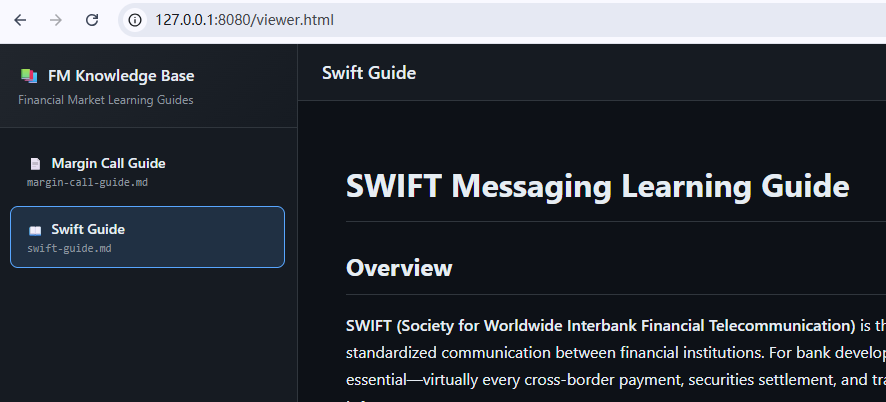

<div align="right">
  <a href="README.md">中文</a> | <a href="README_EN.md">English</a>
</div>

# FM Knowledge Guide

> 🎓 AI Skill to help bank developers and business analysts master financial market knowledge



---

## ✨ Features

| Feature | Description |
|---------|-------------|
| 📚 **Comprehensive Coverage** | Covers derivatives, collateral management, trade lifecycle, regulatory frameworks |
| 🎯 **Role-Adaptive** | Automatically adjusts content depth based on user role (Developer/BA/Operations) |
| 📊 **Mermaid Diagrams** | Auto-generates flowcharts, sequence diagrams, ER diagrams |
| 🌐 **Built-in Doc Viewer** | Dark theme web UI with Markdown rendering and diagram support |
| 📁 **Auto-Archive** | Generated docs automatically saved to `docs/fm-guide/` directory |

## 📖 Supported Topics

- **Derivatives**: Swaps, Options, Futures, Forwards, IRS, CCS
- **Collateral Management**: CSA, Margin Call, VM/IM, Haircut, Threshold
- **Trade Lifecycle**: Confirmation, Clearing, Settlement, DVP
- **Messaging Standards**: SWIFT MT/MX, FIX, FpML, ISO 20022
- **Regulations**: EMIR, Dodd-Frank, MiFID II, Basel III, UMR
- **Risk Management**: VaR, PFE, CVA, Greeks

---

## 🚀 Usage

### Method 1: Workflow Trigger (Recommended)

In AI editors with workflow support, use `@/fm-knowledge-guider` to trigger:

```
@/fm-knowledge-guider margin call
@/fm-knowledge-guider SWIFT
@/fm-knowledge-guider CSA
```

**Advantages**:
- ✅ No installation required, works out of the box
- ✅ Automatically loads relevant reference materials
- ✅ Auto-generates docs and launches viewer

---

### Method 2: Skill Installation

Install locally via `npx skills` command:

```bash
# Install skill
npx skills add Kooooooma/skills@fm-knowledge-guide -g -y

# Verify installation
npx skills list | grep fm-knowledge-guide
```

Once installed, the AI assistant will automatically recognize financial market questions and invoke this skill.

---

## 📂 Output

Generated learning documents are saved in the project's `docs/fm-guide/` directory:

```
docs/fm-guide/
├── margin-call-guide.md    # Margin Call Learning Guide
├── swift-guide.md          # SWIFT Messaging Standards Guide
├── csa-guide.md            # CSA Collateral Agreement Guide
└── viewer.html             # Document Viewer
```

### Launch Document Viewer

```bash
npx -y http-server docs/fm-guide -p 0 -o /viewer.html
```

Browser will auto-open with sidebar showing all generated docs, and main panel rendering Markdown content with Mermaid diagrams.

---

## 🏗️ Project Structure

```
fm-knowledge-guide/
├── SKILL.md                 # Skill entry point and workflow definition
├── references/              # Financial domain reference materials
│   ├── collateral-management.md
│   ├── derivatives-basics.md
│   ├── trade-lifecycle.md
│   ├── messaging-standards.md
│   ├── regulatory-framework.md
│   ├── risk-management.md
│   ├── market-data.md
│   ├── domain-overview.md
│   └── glossary.md
└── templates/
    ├── learning-guide-template.md  # Document generation template
    └── viewer.html                 # Web viewer template
```

---

## 📝 Example Interactions

| User Input | Generated Content |
|------------|-------------------|
| `margin call` | Complete lifecycle, VM vs IM comparison, calculation formulas |
| `SWIFT` | MT/MX message formats, ISO 20022 migration, field mapping |
| `CSA` | ISDA framework, collateral terms, system implementation |
| `trade lifecycle` | Pre-trade/execution/post-trade flow, T+2 settlement |

---

## ⭐ Star History

[](https://star-history.com/#Kooooooma/skills&Date)

---

## 📄 License

Apache License 2.0
