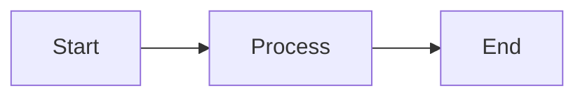
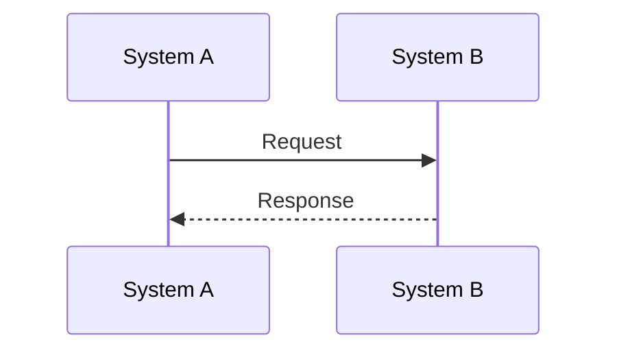
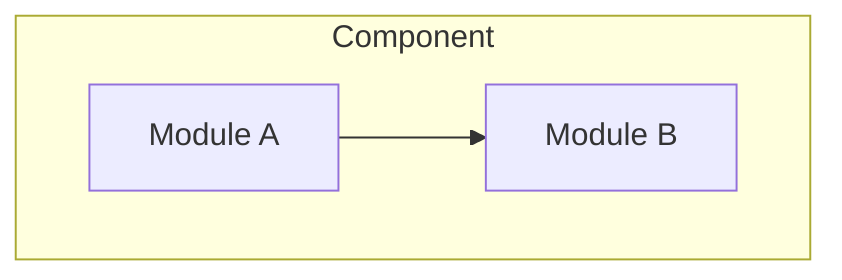

# Financial Market Master

This skill helps bank developers and Business Analysts understand financial market business knowledge in the context of banking IT systems.

## When to Use

This skill is triggered when users:
- Ask about financial market concepts (derivatives, FX, fixed income, equity)
- Need to understand trade lifecycle processes
- Want to learn about collateral management and margin calls
- Seek knowledge about regulatory requirements
- Need business context for building trading/settlement systems

## Core Workflow

### Step 1: Identify the Domain

Determine which financial domain the user is asking about:

| Domain | Reference File | Topics Covered |
|--------|----------------|----------------|
| Market Overview | `references/domain-overview.md` | Asset classes, market participants, infrastructure |
| Derivatives | `references/derivatives-basics.md` | Swaps, options, futures, forwards, pricing |
| Collateral | `references/collateral-management.md` | CSA, margin calls, VM/IM, eligible collateral |
| Trade Lifecycle | `references/trade-lifecycle.md` | Execution, confirmation, clearing, settlement |
| Regulations | `references/regulatory-framework.md` | EMIR, Dodd-Frank, MiFID II, Basel III, UMR |
| Terminology | `references/glossary.md` | Financial terms A-Z |

### Step 2: Load Relevant Reference

Based on the user's question, load the appropriate reference file(s) to provide accurate, detailed information.

### Step 3: Explain with Context

When explaining concepts:

1. **Start with the "Why"**: Explain the business purpose
2. **Describe the "What"**: Define the concept clearly
3. **Show the "How"**: Illustrate with practical examples
4. **Connect to Systems**: Relate to IT system implementation

### Step 4: Generate Learning Document

**Always generate a comprehensive learning document** following these guidelines:

> **IMPORTANT OUTPUT RULES**:
> 1. Do NOT include instruction labels like "(REQUIRED)", "(DYNAMIC)", "(if applicable)" in output
> 2. Table of Contents must have clickable links (`#section-name`) matching actual generated sections
> 3. References section must link to REAL external URLs (official docs, not placeholders)
> 4. Replace all `[Topic]`, `[Concept A]` placeholders with actual content

---

#### Document Structure

```markdown
# [Topic] Learning Guide

## Overview
- What this topic is and why it matters
- Business context and industry background  
- Target audience (roles/teams who need this)

## Table of Contents
<!-- DYNAMIC: Generate links based on actual sections included -->
- [Section Name](#section-name)
- [Another Section](#another-section)
  - [Subsection](#subsection)
...
```

---

#### Required Sections (ALWAYS include these)

**1. Core Concepts**
```markdown
## Core Concepts
### Terminology & Definitions
### Conceptual Model (with Mermaid diagram)
```

**2. System Implementation**
```markdown
## System Implementation
### Data Model (with ER diagram)
### System Integration Points
### Processing Logic
```

**3. Real-World Scenarios**
```markdown
## Real-World Scenarios
### Scenario 1: [Normal Case]
### Scenario 2: [Edge Case]  
### Scenario 3: [Exception/Dispute]
```

---

#### Dynamic Sections (include when relevant to topic)

**Lifecycle** - Include for process/flow topics (margin call, trade lifecycle, settlement)
```markdown
## [Topic] Lifecycle
### End-to-End Flow (with sequence diagram)
### Phase Breakdown (Trigger → Actions → Output → Exceptions)
```

**Comparisons** - Include when explaining differences (VM vs IM, Pledge vs Title Transfer)
```markdown
## [Concept A] vs [Concept B]
| Aspect | A | B |
|--------|---|---|
| Purpose | ... | ... |
```

**Calculations** - Include for topics with formulas (margin calculation, haircut, interest)
```markdown
## Calculation & Formulas
- Formula with explanation
- Worked example with numbers
- Common pitfalls
```

**Handling Scenarios** - Include for operational topics
```markdown
## Handling Scenarios
### Normal Processing
### Exception Handling
### Dispute Resolution
```

**Best Practices** - Include for implementation guidance
```markdown
## Best Practices & Pitfalls
### Do's
### Don'ts
```

---

#### References Section (ALWAYS include, with REAL links)

```markdown
## References & Resources
<!-- DYNAMIC: Search and include actual official URLs relevant to the topic -->
```

**Link to real external resources based on topic:**

| Topic Area | Example Resources |
|------------|-------------------|
| Margin/Collateral | [ISDA](https://www.isda.org/), [UMR Guidelines](https://www.bis.org/bcbs/publ/d317.htm) |
| Trading | [FpML](https://www.fpml.org/), [FIX Protocol](https://www.fixtrading.org/) |
| Regulatory | [EMIR](https://eur-lex.europa.eu/), [Dodd-Frank](https://www.cftc.gov/), [Basel](https://www.bis.org/) |
| Platforms | [Acadiasoft](https://www.acadiasoft.com/), [DTCC](https://www.dtcc.com/) |

---

#### Appendix (optional)
```markdown
## Appendix
### Glossary
### Reference Data
```
- Always include: Overview, Core Concepts, System Implementation, Real-World Scenarios
- Add Lifecycle section for any process/flow topics
- Add Comparison sections when explaining differences (VM vs IM, Pledge vs Title Transfer)
- Add Calculation section for topics involving formulas
- Add Handling sections for operational topics

### Step 5: Save to Project Docs Directory (REQUIRED)

**You MUST save the generated learning document to the project's docs directory.**

**Output Path Convention**:
```
docs/fm-guide/[topic-name]-guide.md
```

**Naming Rules**:
- Use lowercase with hyphens for topic name
- Always suffix with `-guide.md`
- Group under `fm-guide` subdirectory

**Examples**:
| Topic | Output Path |
|-------|-------------|
| Margin Call | `docs/fm-guide/margin-call-guide.md` |
| CSA | `docs/fm-guide/csa-guide.md` |
| Acadia | `docs/fm-guide/acadia-guide.md` |
| Trade Lifecycle | `docs/fm-guide/trade-lifecycle-guide.md` |
| ISDA SIMM | `docs/fm-guide/isda-simm-guide.md` |

**After saving**, notify the user with the file path so they can review the generated document.

### Step 6: Ensure Document Viewer Exists (REQUIRED)

**Before finishing, you MUST check and copy the viewer.html.**

1. Check if `docs/fm-guide/viewer.html` exists in the project
2. If NOT exists, copy from skill templates:
   - Source: `fm-knowledge-guide/templates/viewer.html`
   - Destination: `docs/fm-guide/viewer.html`

**Implementation**:
```powershell
# Check and copy viewer.html if not exists
if (!(Test-Path "docs/fm-guide/viewer.html")) {
    Copy-Item "<skill-path>/templates/viewer.html" "docs/fm-guide/viewer.html"
}
```

This ensures the document viewer is always available for browsing generated guides.
The viewer dynamically lists all .md files in the same directory.

### Step 7: Launch Document Viewer (OPTIONAL)

If the user wants to view documents in browser, launch a local HTTP server:

```bash
npx -y http-server docs/fm-guide -p 0 -o /viewer.html
```

**Options**:
- `-p 0`: Use any available port
- `-o /viewer.html`: Auto-open browser to viewer

**Viewer Features**:
- Dynamically lists all `.md` files in the directory
- Left sidebar for navigation
- Right panel renders Markdown with Mermaid diagrams
- Dark theme with modern UI


## Topic Quick Reference

### Derivatives
- **Swaps**: Interest Rate Swaps (IRS), Cross Currency Swaps (CCS), FX Swaps
- **Options**: Vanilla options, exotic options, swaptions
- **Futures/Forwards**: Exchange-traded vs OTC

### Collateral Management
- **CSA**: Credit Support Annex under ISDA Master Agreement
- **Margin Types**: Variation Margin (VM), Initial Margin (IM)
- **Margin Call Flow**: Call → Agree → Pledge → Settle

### Trade Lifecycle
- **Pre-trade**: Pricing, credit check
- **Execution**: Trade capture, booking
- **Post-trade**: Confirmation, matching, clearing, settlement

### Key Dates
- **Trade Date (T)**: When the trade is executed
- **Value Date**: When the trade takes economic effect
- **Settlement Date**: When cash/securities move
- **Maturity Date**: When the trade ends

## Research Methodology

When researching unfamiliar financial topics:

1. **Search authoritative sources**: ISDA, regulatory bodies, major banks' documentation
2. **Verify with multiple sources**: Cross-reference information
3. **Focus on practical application**: How it affects real banking systems
4. **Include examples**: Concrete scenarios help understanding

## Output Guidelines

- Use clear, precise financial terminology
- Include diagrams for complex flows (Mermaid format)
- Provide both business and technical perspectives
- Always cite concepts' practical implications for IT systems

## Diagram Guidelines (REQUIRED)

**Always use Mermaid format** for all diagrams to ensure consistent styling across documents.

### Supported Diagram Types

| Diagram Type | Use Case | Syntax |
|--------------|----------|--------|
| `flowchart` | Process flows, decision trees | `flowchart LR` or `flowchart TB` |
| `sequenceDiagram` | Message exchanges, API calls | `sequenceDiagram` |
| `graph` | Architecture, relationships | `graph TB` or `graph LR` |
| `stateDiagram-v2` | State machines, lifecycle | `stateDiagram-v2` |

### Example Patterns

**Process Flow**:


**Sequence Diagram**:


**Architecture Diagram**:


### Style Rules

1. **Use subgraphs** to group related components
2. **Add labels** with `<br/>` for multi-line text in nodes
3. **Keep diagrams focused** - one concept per diagram
4. **Use consistent direction** - LR for flows, TB for hierarchies
