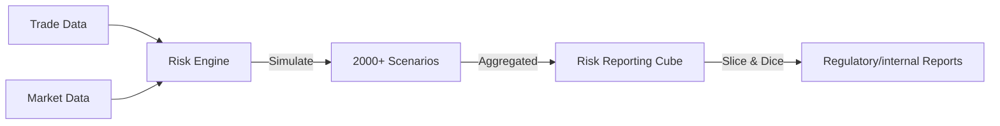

# Risk Management for Developers

## Overview
Risk management systems calculate, monitor, and report the potential losses a bank faces. For developers, this means dealing with massive datasets (historical simulation), complex calculation engines (Monte Carlo), and real-time aggregation.

---

## 1. Market Risk
The risk of losses in positions arising from movements in market prices.

### Key Metrics
- **VaR (Value at Risk)**: Max expected loss over a time horizon (e.g., 10 days) at a confidence level (e.g., 99%).
  > *Example*: "10-day 99% VaR is $1M" means there is a 1% chance we lose >$1M in the next 10 days.
- **ES (Expected Shortfall)**: The average loss *if* the loss exceeds VaR (tail risk).
- **Sensitivities (Greeks)**: Delta (Price), Gamma (Convexity), Vega (Vol), Rho (Rates).

### System Implementation
- **Historical Simulation**: Re-pricing current portfolio using last 500 days of market moves.
  - *Data Load*: Heavy. Requires 500 scenarios x 5000 market factors.
- **Stress Testing**: Re-pricing under meaningful shocks (e.g., "Lehman Collapse 2008").

---

## 2. Counterparty Credit Risk (CCR)
The risk that the counterparty enters default before the final settlement of the transaction's cash flows.

### Key Metrics
- **PFE (Potential Future Exposure)**: Maximum expected credit exposure over a specified period.
  - Used for checking **Credit Limits** (Pre-deal check).
- **EPE (Expected Positive Exposure)**: Average exposure over time, used for pricing.
- **CVA (Credit Valuation Adjustment)**: The market value of this counterparty risk.
  > *Formula*: $CVA = \sum (Probability \ of \ Default \times Loss \ Given \ Default \times Exposure)$

### XVA Family
Adjustments to the fair value of a trade:
- **CVA**: Credit risk cost.
- **DVA (Debit)**: Own credit risk benefit.
- **FVA (Funding)**: Cost of funding uncollateralized derivatives.
- **KVA (Capital)**: Cost of holding regulatory capital.

---

## 3. System Architecture

### Risk Engine Workflow

### Data Requirements
1.  **Trade Snapshots**: EOD static view of all 100k+ trades.
2.  **Market Scenarios**: Simulated path of FX rates, Interest curves, etc.
3.  **Static Data**: Counterparty hierarchy, netting sets, credit ratings.

## 4. Regulatory Capital (Basel)
- **RWA (Risk Weighted Assets)**: Denominator for capital ratio.
- **SA-CCR**: Standardized approach for calculating exposure size.
- **FRTB (Fundamental Review of the Trading Book)**: Strict rules for market risk capital.
