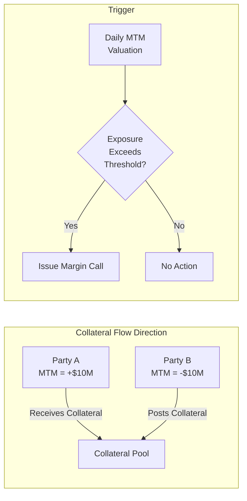
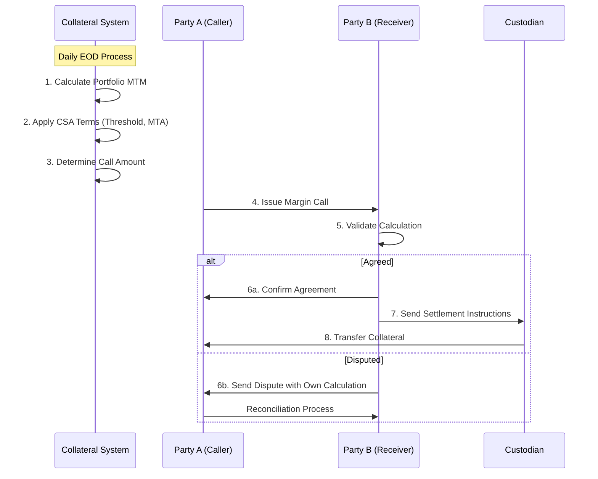
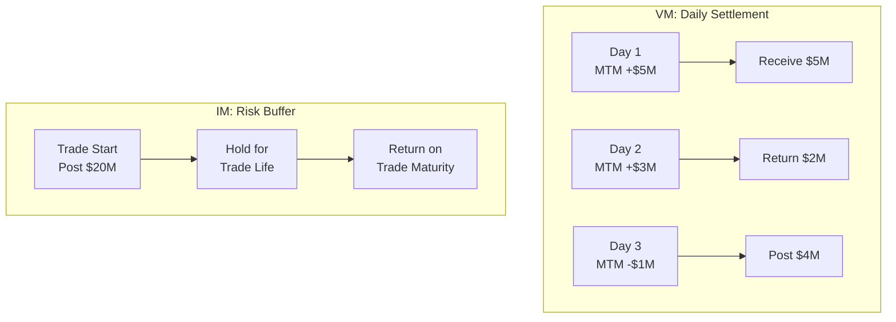
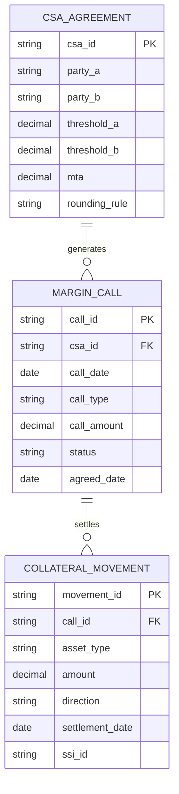
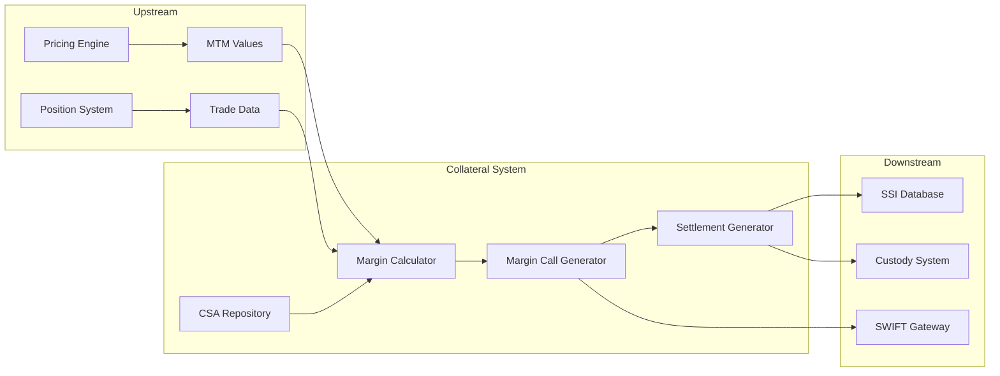
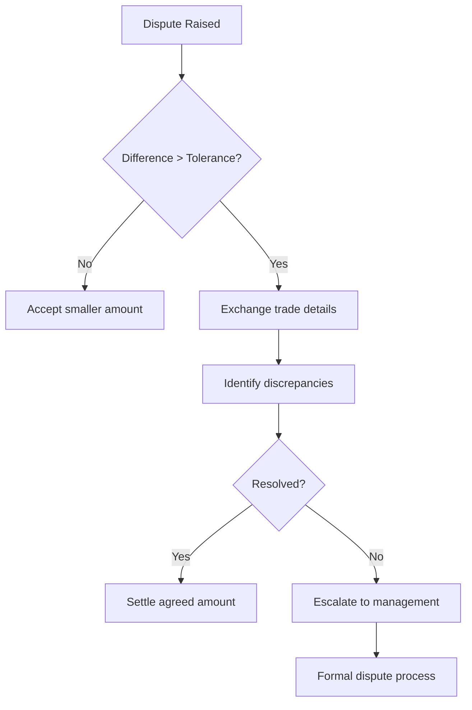

# Margin Call Learning Guide

## Overview

A **Margin Call** is a formal request from one counterparty to another to transfer collateral in order to cover credit exposure arising from OTC derivative transactions. Margin calls are the operational heartbeat of collateral management—they translate mark-to-market (MTM) valuations into actual asset movements between counterparties.

**Why it matters:**
- Protects both parties from counterparty credit risk
- Required by regulations (EMIR, Dodd-Frank, UMR)
- Triggers daily operational workflows in collateral management teams
- Directly impacts a bank's liquidity and funding costs

**Target Audience:** Developers building collateral management systems, Business Analysts designing margin workflows, Operations staff processing daily margin calls.

---

## Table of Contents

- [Core Concepts](#core-concepts)
- [Margin Call Lifecycle](#margin-call-lifecycle)
- [Variation Margin vs Initial Margin](#variation-margin-vs-initial-margin)
- [Calculation & Formulas](#calculation--formulas)
- [Eligible Collateral & Haircuts](#eligible-collateral--haircuts)
- [System Implementation](#system-implementation)
- [Real-World Scenarios](#real-world-scenarios)
- [Handling Scenarios](#handling-scenarios)
- [Best Practices & Pitfalls](#best-practices--pitfalls)
- [References & Resources](#references--resources)
- [Appendix](#appendix)

---

## Core Concepts

> **TL;DR**: A margin call is triggered when portfolio MTM changes cause a collateral imbalance—the party "in the money" demands collateral from the party "out of the money."

### Terminology & Definitions

| Term | Definition |
|------|------------|
| **MTM (Mark-to-Market)** | The current market value of a derivative portfolio |
| **Margin Call** | A demand for collateral when there is a deficit |
| **Return Amount** | Return of excess collateral when there is a surplus |
| **Threshold** | The exposure level below which no collateral is required |
| **MTA (Minimum Transfer Amount)** | The smallest amount that can be transferred |
| **CSA (Credit Support Annex)** | Legal agreement defining collateral terms under ISDA |
| **Haircut** | Discount applied to collateral value for volatility risk |
| **Pledge** | Transfer of collateral while retaining legal ownership |
| **Title Transfer** | Full transfer of ownership to the collateral receiver |

### Conceptual Model



> ⚠️ **Watch Out**: MTM sign convention matters! Positive MTM = "In the Money" = you are owed. Negative MTM = "Out of the Money" = you owe.

### Call Direction Quick Reference

| Scenario | Your MTM Position | Action |
|----------|-------------------|--------|
| MTM is Positive | In the Money | You **receive** collateral |
| MTM is Negative | Out of the Money | You **post** collateral |
| Collateral Excess | Over-collateralized | You **return** collateral |

---

## Margin Call Lifecycle

> **TL;DR**: The lifecycle follows four phases: Calculate → Call → Agree → Settle.

### End-to-End Flow



### Phase Breakdown

| Phase | Trigger | Actions | Output | Exceptions |
|-------|---------|---------|--------|------------|
| **1. Calculate** | COB (Close of Business) | Aggregate MTM by CSA, apply thresholds | Required collateral amount | Stale prices, missing trades |
| **2. Call** | Calculation complete | Generate and send margin call message | MC/Return Amount notice | Communication failure |
| **3. Agree** | Call received | Counterparty validates and responds | Agreement or dispute | Calculation differences |
| **4. Settle** | Agreement reached | Generate SSI, transfer assets | Collateral movement | Settlement failure |

---

## Variation Margin vs Initial Margin

| Aspect | Variation Margin (VM) | Initial Margin (IM) |
|--------|----------------------|---------------------|
| **Purpose** | Cover current MTM exposure | Cover potential future exposure |
| **Calculation Basis** | Daily mark-to-market | Risk models (ISDA SIMM, CCP internal) |
| **Exchange Frequency** | Daily | Upfront + periodic recalculation |
| **Direction** | Two-way (both parties may post) | Two-way (both parties post) |
| **Segregation** | Not required | Required at third-party custodian |
| **Regulatory Driver** | EMIR, Dodd-Frank | UMR (Uncleared Margin Rules) |
| **Return on Close-out** | Immediate offset | After close-out period (10 days) |



---

## Calculation & Formulas

### Variation Margin Calculation

```
VM Call Amount = (MTM - Collateral Held) - Threshold

If VM Call Amount > MTA → Issue Margin Call
If VM Call Amount < -MTA → Issue Return Amount
Otherwise → No Transfer
```

### Worked Example

**Given:**
- Portfolio MTM: +$12,500,000 (you are in the money)
- Current Collateral Held: $8,000,000
- Threshold: $1,000,000
- MTA: $500,000
- Rounding: $100,000

**Calculation:**
```
Uncollateralized Exposure = MTM - Collateral Held
                         = $12,500,000 - $8,000,000 
                         = $4,500,000

Call Amount = Uncollateralized Exposure - Threshold
            = $4,500,000 - $1,000,000
            = $3,500,000

After Rounding: $3,500,000 (no adjustment needed)

Since $3,500,000 > MTA ($500,000) → Issue Margin Call for $3,500,000
```

### Day Count Convention for Interest

Interest on cash collateral (PAI) uses specific conventions:

| Currency | Typical Convention | Reference Rate |
|----------|-------------------|----------------|
| USD | ACT/360 | SOFR |
| EUR | ACT/360 | €STR |
| GBP | ACT/365 | SONIA |

---

## Eligible Collateral & Haircuts

### Collateral Priority (Most to Least Common)

| Type | Haircut Range | Liquidity | Usage |
|------|---------------|-----------|-------|
| Cash (USD, EUR) | 0% | Immediate | ~80% of all collateral |
| G7 Government Bonds | 0.5% - 5% | Same-day | ~15% |
| Investment Grade Corporate | 5% - 15% | T+1 to T+3 | ~4% |
| Equities | 15% - 25% | T+2 | ~1% (rarely accepted) |

### Haircut Application Formula

```
Collateral Credit = Market Value × (1 - Haircut%)

Example:
$10M face value US Treasury (2-year maturity)
Haircut: 2%
Collateral Credit = $10,000,000 × (1 - 0.02) = $9,800,000
```

---

## System Implementation

> **TL;DR**: Margin call systems integrate MTM feeds, apply CSA rules, and generate settlement instructions.

### Data Model



### Field Mapping (Business → System)

| Business Term | Database Field | SWIFT Message | FpML Element |
|---------------|----------------|---------------|--------------|
| Call Date | margin_call.call_date | MT527:DATE | marginCallDate |
| Call Amount | margin_call.call_amount | MT527:19A:COLL | marginCallAmount |
| Call Direction | margin_call.call_type | MT527:22F:CALL | marginCallType |
| Settlement Date | movement.settlement_date | MT527:98A:SETT | settlementDate |
| Collateral Type | movement.asset_type | MT527:35B | assetClass |

### System Integration Points



---

## Real-World Scenarios

### Scenario 1: Normal Daily Margin Call

**Context:** End of Day processing for a bilateral IRS portfolio under CSA.

```
EOD MTM: +$25M (Portfolio is in the money)
Yesterday's Collateral: $20M
Threshold: $5M
MTA: $1M

Calculation:
Exposure = $25M - $20M = $5M
Required = $5M - $5M (threshold) = $0M

Result: No margin call needed (within threshold)
```

### Scenario 2: Large MTM Swing Triggers Call

**Context:** Market volatility causes significant MTM movement.

```
Morning MTM: +$10M
EOD MTM: +$35M (after rate shock)
Current Collateral: $8M
Threshold: $2M
MTA: $500K

Calculation:
Exposure = $35M - $8M = $27M
Required = $27M - $2M = $25M

Result: Issue Margin Call for $25M
```

### Scenario 3: Dispute Resolution

**Context:** Counterparty disagrees with MTM valuation.

```
Your Calculation: Call for $15M
Their Calculation: Call for $12M
Difference: $3M

Resolution Steps:
1. Exchange portfolio details
2. Identify trade-level differences
3. Reconcile pricing sources
4. Agree on resolution amount
5. If unresolved, escalate to senior management
```

---

## Handling Scenarios

### Normal Processing

1. **T+0 17:00** - COB cutoff, MTM snapshot taken
2. **T+0 18:00** - Margin calculation batch runs
3. **T+0 19:00** - Margin calls generated and sent
4. **T+1 10:00** - Counterparty confirms agreement
5. **T+1 Settlement** - Collateral transferred

### Exception Handling

| Exception | Detection | Action |
|-----------|-----------|--------|
| Missing MTM | Validation check | Use prior day value + alert |
| SSI not found | Enrichment failure | Hold call, request SSI update |
| Settlement failure | Custody feedback | Retry next day, manual escalation |
| Communication timeout | No response | Resend via alternative channel |

### Dispute Resolution Process



---

## Best Practices & Pitfalls

### Do's ✅

- **Always validate MTM sources** before generating calls
- **Apply thresholds and MTA correctly** - order matters
- **Round according to CSA terms** - typically to nearest $100K
- **Track settlement confirmations** - don't assume success
- **Maintain an audit trail** for all call activities
- **Use netting agreements** to reduce gross exposure

### Don'ts ❌

- **Never mix VM and IM calculations** - they have different rules
- **Never skip the agreement step** - both parties must confirm
- **Never apply haircuts to cash** - cash haircut is always 0%
- **Never ignore timezone differences** - COB times vary by location
- **Never assume overnight settlement** - most collateral settles T+1
- **Never use placeholder SSIs** - invalid SSIs cause failed settlements

### Common Pitfalls

| Pitfall | Impact | Prevention |
|---------|--------|------------|
| Wrong MTM sign | Pay instead of receive | Validate sign convention in feeds |
| Missing threshold | Over-calling collateral | CSA terms must be correctly loaded |
| Stale SSI | Settlement failure | Regular SSI validation process |
| FX conversion errors | Incorrect amounts | Use consistent FX rate source |

---

## References & Resources

### Official Standards

- [ISDA Credit Support Documentation](https://www.isda.org/book/isda-credit-support-documentation/) - Industry standard CSA templates
- [ISDA SIMM Methodology](https://www.isda.org/2023/12/11/isda-simm-v2-6/) - Initial Margin calculation model
- [BIS Margin Requirements for Non-Centrally Cleared Derivatives](https://www.bis.org/bcbs/publ/d317.htm) - UMR regulatory framework

### Regulatory Guidance

- [EMIR Technical Standards (EU)](https://eur-lex.europa.eu/legal-content/EN/TXT/?uri=CELEX:32012R0648) - European margin requirements
- [CFTC Margin Rules (US)](https://www.cftc.gov/LawRegulation/DoddFrankAct/Rulemakings/DF_26_IMReq/index.htm) - US uncleared margin rules

### Industry Platforms

- [AcadiaSoft MarginSphere](https://www.acadiasoft.com/marginsphere/) - Industry-leading margin call platform
- [DTCC CTM](https://www.dtcc.com/repository-and-derivatives-services/derivatives-services/ctm) - Trade confirmation matching

---

## Appendix

### Glossary

| Term | Definition |
|------|------------|
| **Close-out Netting** | Legal right to net all positions upon default |
| **COB** | Close of Business - the cutoff time for daily processing |
| **Independent Amount** | Fixed collateral amount similar to IM |
| **MTM** | Mark-to-Market valuation |
| **Novation** | Substitution of a new contract for an existing one |
| **PAI** | Price Alignment Interest - interest on cash collateral |
| **Rehypothecation** | Right to reuse posted collateral |
| **SSI** | Standard Settlement Instructions |
| **T+1/T+2** | Settlement cycle (Trade date + 1 or 2 days) |
| **Title Transfer** | Full ownership transfer of collateral |
| **Tri-Party** | Collateral managed by a third-party agent |

### Day Count Conventions

| Convention | Calculation | Common Use |
|------------|-------------|------------|
| ACT/360 | Actual days / 360 | Money markets, SOFR |
| ACT/365 | Actual days / 365 | GBP markets |
| 30/360 | 30-day months / 360 | Bond markets |
| ACT/ACT | Actual / Actual | Treasury bonds |

### Sample Margin Call Message Structure

```
=== MARGIN CALL ===
Call Reference: MC-2026-01-31-001
Call Date: 2026-01-31
Call Type: Variation Margin
Direction: Receive

CSA Reference: CSA-12345
Counterparty: ABC Bank
Base Currency: USD

Portfolio MTM: $25,000,000.00
Current Collateral: $20,000,000.00
Threshold: $5,000,000.00
MTA: $500,000.00

Call Amount: $0.00
Status: Within Threshold - No Transfer Required

Settlement Instructions: [See SSI Database]
```
