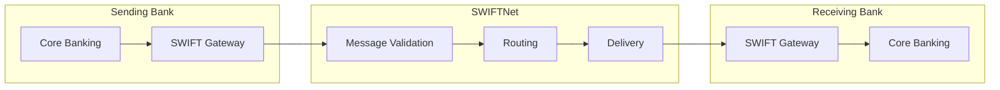
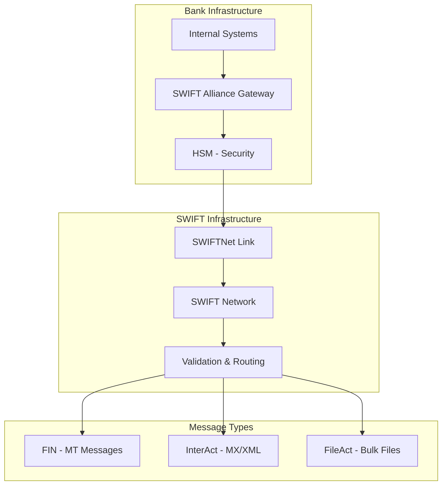
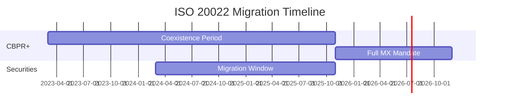
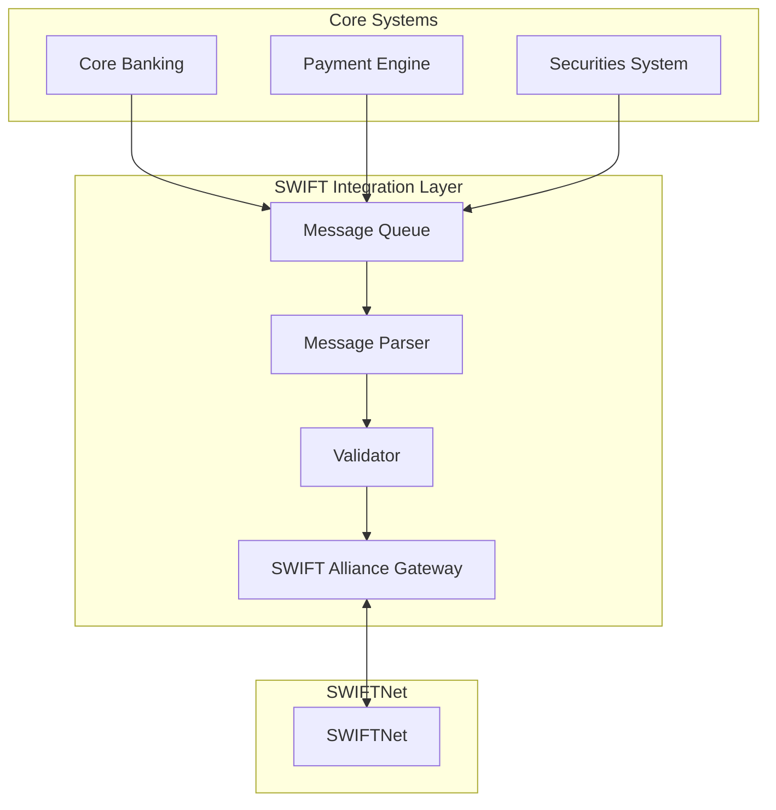
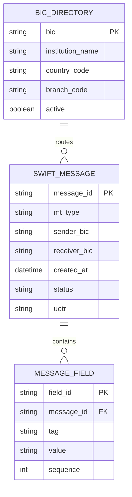
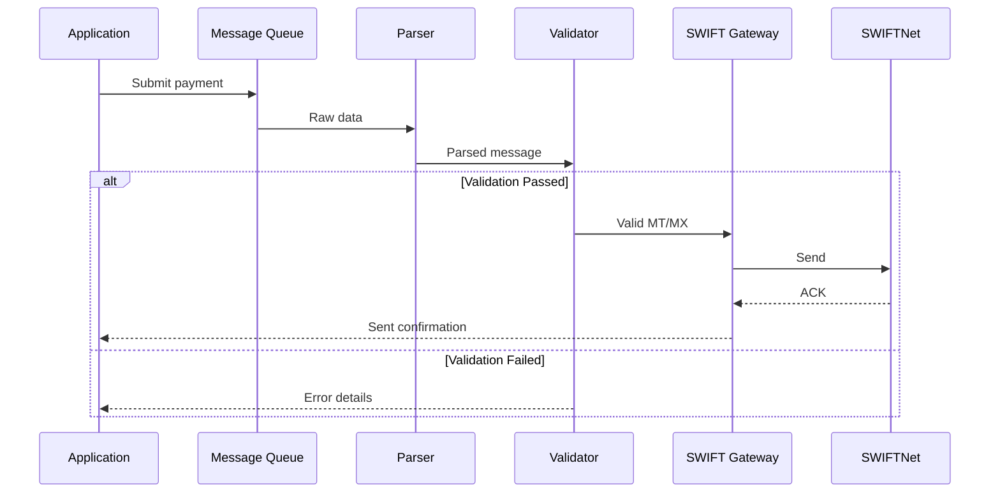

# SWIFT Messaging Learning Guide

## Overview

**SWIFT (Society for Worldwide Interbank Financial Telecommunication)** is the global messaging network that enables secure, standardized communication between financial institutions. For bank developers and business analysts, understanding SWIFT is essential—virtually every cross-border payment, securities settlement, and trade confirmation flows through SWIFT infrastructure.

**Why it matters:**
- Powers over 11,000 financial institutions in 200+ countries
- Processes 40+ million messages per day
- Industry-mandated for most interbank communications
- ISO 20022 migration is the #1 project in most banks right now

**Target Audience:** Developers building payment systems, BAs designing trade confirmation workflows, Operations staff processing settlements.

---

## Table of Contents

- [Core Concepts](#core-concepts)
- [MT vs MX Message Formats](#mt-vs-mx-message-formats)
- [Common MT Message Types](#common-mt-message-types)
- [ISO 20022 (MX) Standards](#iso-20022-mx-standards)
- [Message Structure Deep Dive](#message-structure-deep-dive)
- [System Implementation](#system-implementation)
- [Real-World Scenarios](#real-world-scenarios)
- [Best Practices & Pitfalls](#best-practices--pitfalls)
- [References & Resources](#references--resources)
- [Appendix](#appendix)

---

## Core Concepts

> **TL;DR**: SWIFT provides the messaging network (SWIFTNet) and message standards (MT/MX) for secure inter-bank communication.

### Terminology & Definitions

| Term | Definition |
|------|------------|
| **SWIFTNet** | The secure network infrastructure for message transmission |
| **BIC (Bank Identifier Code)** | 8 or 11-character code identifying a bank (e.g., CITIUS33) |
| **MT (Message Type)** | Legacy text-based message format (e.g., MT103) |
| **MX** | Modern XML-based ISO 20022 format (e.g., pacs.008) |
| **FIN** | SWIFT's traditional messaging service using MT format |
| **InterAct** | Service for XML-based messaging (MX) |
| **FileAct** | Service for bulk file transfers |
| **SWIFT gpi** | Global Payments Innovation—enhanced tracking for payments |

### Conceptual Model



> ⚠️ **Watch Out**: BIC codes can be 8 or 11 characters. The 11-character version includes a branch code suffix. Always pad with "XXX" if branch is unknown.

### SWIFT Network Architecture



---

## MT vs MX Message Formats

| Aspect | MT (Legacy) | MX (ISO 20022) |
|--------|-------------|----------------|
| **Format** | Structured text blocks | XML |
| **Character Set** | Limited (ASCII subset) | Unicode (full character support) |
| **Data Richness** | Fixed fields, limited info | Extended data elements |
| **Extensibility** | Rigid structure | Flexible, extensible |
| **Remittance Info** | 4 x 35 characters | 9,000+ characters |
| **Status** | Being phased out | Mandatory by Nov 2025 |
| **Example** | MT103, MT202 | pacs.008, pacs.009 |

### Migration Timeline (Cross-Border Payments)



---

## Common MT Message Types

### Category Overview

| Category | Range | Purpose |
|----------|-------|---------|
| **1xx** | Customer Payments | Single customer transfers |
| **2xx** | Financial Institution Transfers | Bank-to-bank movements |
| **3xx** | Treasury Markets | FX, Derivatives confirmations |
| **4xx** | Collections & Cash Letters | Documentary credits |
| **5xx** | Securities Markets | Settlement, corporate actions |
| **6xx** | Precious Metals & Syndications | Commodity trading |
| **7xx** | Documentary Credits | Letters of credit |
| **9xx** | Cash Management | Balance & transaction reports |

### Key Message Types for Developers

| MT Type | Purpose | Replacement (MX) |
|---------|---------|------------------|
| **MT103** | Single Customer Credit Transfer | pacs.008 |
| **MT202** | Bank Transfer (Cover) | pacs.009 |
| **MT202 COV** | Cover payment (with MT103) | pacs.009 |
| **MT300** | FX Confirmation | fxtr.014 |
| **MT305** | FX Option Confirmation | fxtr.017 |
| **MT540** | Receive Free (Securities) | sese.023 |
| **MT541** | Receive Against Payment | sese.023 |
| **MT542** | Deliver Free | sese.023 |
| **MT543** | Deliver Against Payment | sese.023 |
| **MT940** | Customer Statement | camt.053 |
| **MT950** | Statement Message | camt.053 |

---

## ISO 20022 (MX) Standards

> **TL;DR**: ISO 20022 is the new XML-based standard with richer data that's replacing all MT messages.

### Message Type Naming Convention

```
[business area].[message type].[version].[variant]

Example: pacs.008.001.10
- pacs = Payments Clearing and Settlement
- 008 = FI to FI Customer Credit Transfer
- 001 = First message in the group
- 10 = Version 10
```

### Business Area Codes

| Code | Business Area | Example Messages |
|------|---------------|------------------|
| **pacs** | Payments Clearing & Settlement | pacs.008, pacs.009 |
| **pain** | Payment Initiation | pain.001, pain.002 |
| **camt** | Cash Management | camt.053, camt.054 |
| **sese** | Securities Settlement | sese.023, sese.024 |
| **setr** | Securities Trade | setr.001, setr.002 |
| **fxtr** | FX Transactions | fxtr.014, fxtr.017 |
| **colr** | Collateral Management | colr.003, colr.004 |

### Key MX Messages

| MX Message | Purpose | Replaces MT |
|------------|---------|-------------|
| **pacs.008** | Customer Credit Transfer | MT103 |
| **pacs.009** | FI Credit Transfer | MT202/202 COV |
| **pacs.002** | Payment Status Report | MT199/299 |
| **camt.053** | Bank to Customer Statement | MT940/950 |
| **camt.054** | Account Notification | MT900/910 |
| **sese.023** | Securities Settlement Instruction | MT540-543 |

---

## Message Structure Deep Dive

### MT Message Block Structure

An MT message consists of 5 blocks:

```
{1:F01BANKUS33AXXX0000000000}    ← Basic Header
{2:I103BANKGB2LXXXXN}             ← Application Header
{3:{108:MT103REF12345}}           ← User Header (Optional)
{4:                               ← Text Block (Body)
:20:REF123456789
:23B:CRED
:32A:260131USD100000,00
:50K:/12345678
JOHN DOE
123 MAIN ST
:59:/98765432
JANE SMITH
456 HIGH ST
:71A:OUR
-}
{5:{MAC:12345678}{CHK:ABCDEFGH}}  ← Trailer
```

### Block Breakdown

| Block | Content | Example |
|-------|---------|---------|
| **Block 1** | Basic Header (BIC, terminal) | `{1:F01BANKUS33AXXX0000000000}` |
| **Block 2** | Application Header (direction, type, destination) | `{2:I103BANKGB2LXXXXN}` |
| **Block 3** | User Header (references, priority) | `{3:{108:REF123}}` |
| **Block 4** | Text Block (actual message content) | Fields :20:, :32A:, etc. |
| **Block 5** | Trailer (MAC, checksum) | `{5:{MAC:...}{CHK:...}}` |

### Common MT103 Fields

| Tag | Name | Description | Example |
|-----|------|-------------|---------|
| **:20:** | Transaction Reference | Unique identifier | `REF123456789` |
| **:23B:** | Bank Operation Code | Type of operation | `CRED` (Credit Transfer) |
| **:32A:** | Value Date/Currency/Amount | When, what currency, how much | `260131USD100000,00` |
| **:50K:** | Ordering Customer | Sender details | Account + Name/Address |
| **:59:** | Beneficiary Customer | Receiver details | Account + Name/Address |
| **:71A:** | Details of Charges | Who pays fees | `OUR`, `BEN`, `SHA` |

### MX (pacs.008) Structure

```xml
<?xml version="1.0" encoding="UTF-8"?>
<Document xmlns="urn:iso:std:iso:20022:tech:xsd:pacs.008.001.10">
  <FIToFICstmrCdtTrf>
    <GrpHdr>
      <MsgId>MSG123456</MsgId>
      <CreDtTm>2026-01-31T12:00:00</CreDtTm>
      <NbOfTxs>1</NbOfTxs>
      <SttlmInf>
        <SttlmMtd>INDA</SttlmMtd>
      </SttlmInf>
    </GrpHdr>
    <CdtTrfTxInf>
      <PmtId>
        <InstrId>INSTR123</InstrId>
        <EndToEndId>E2E123456</EndToEndId>
        <UETR>eb6305c9-1f7f-49de-aed0-16487c27b42d</UETR>
      </PmtId>
      <IntrBkSttlmAmt Ccy="USD">100000.00</IntrBkSttlmAmt>
      <IntrBkSttlmDt>2026-01-31</IntrBkSttlmDt>
      <Dbtr>
        <Nm>John Doe</Nm>
      </Dbtr>
      <Cdtr>
        <Nm>Jane Smith</Nm>
      </Cdtr>
    </CdtTrfTxInf>
  </FIToFICstmrCdtTrf>
</Document>
```

### Field Mapping: MT103 → pacs.008

| MT103 Field | pacs.008 Element | Notes |
|-------------|------------------|-------|
| :20: Transaction Ref | `PmtId/InstrId` | Instruction ID |
| :32A: Value Date | `IntrBkSttlmDt` | Settlement date |
| :32A: Amount | `IntrBkSttlmAmt` | With currency attribute |
| :50K: Ordering Customer | `Dbtr` | Debtor element |
| :59: Beneficiary | `Cdtr` | Creditor element |
| :71A: Charges | `ChrgBr` | Charge bearer |
| N/A | `UETR` | New! Universal End-to-end Reference |

---

## System Implementation

> **TL;DR**: SWIFT integration requires gateway connectivity, message parsing/generation, and validation.

### Integration Architecture



### Data Model



### Processing Logic



---

## Real-World Scenarios

### Scenario 1: Cross-Border Wire Transfer

**Context:** Send $100,000 from US bank to UK beneficiary.

```
1. Core Banking initiates payment request
2. Payment Engine generates MT103:
   - :20: WIRE20260131001
   - :32A: 260131USD100000,00
   - :50K: /12345678 ACME CORP
   - :59: /UK12BANK60161331926819 WIDGETS LTD

3. Validator checks:
   - BIC codes valid
   - Amount format correct
   - Beneficiary details complete

4. Gateway transmits via SWIFTNet FIN
5. Receiving bank processes and credits beneficiary
```

### Scenario 2: FX Confirmation (MT300)

**Context:** Confirm FX spot trade USD/EUR.

```
Trade Details:
- We Sell: USD 10,000,000
- We Buy: EUR 9,100,000
- Rate: 0.9100
- Value Date: 2026-02-02

MT300 Key Fields:
:15A: - New Sequence (Party A details)
:20: FX20260131001
:22A: NEWT (New Transaction)
:22C: CITINY33DEUT (Common Reference)
:30T: 20260131 (Trade Date)
:30V: 20260202 (Value Date)
:36: 0,9100 (Exchange Rate)
```

### Scenario 3: Securities Settlement (MT543)

**Context:** Deliver securities against payment (DVP).

```
Settlement Details:
- ISIN: US0378331005 (Apple Inc.)
- Quantity: 10,000 shares
- Amount: USD 2,500,000
- Settlement Date: T+2

MT543 Key Fields:
:16R:GENL
:20C::SEME//SEC20260131001
:23G:NEWM
:16S:GENL
:16R:TRADDET
:98A::SETT//20260202
:35B:ISIN US0378331005
:16S:TRADDET
```

---

## Best Practices & Pitfalls

### Do's ✅

- **Always validate BIC codes** against the SWIFT BIC Directory
- **Use UETR for tracking** - mandatory for SWIFT gpi payments
- **Handle character set limitations** in MT messages (no lowercase, limited special chars)
- **Parse messages field-by-field** - don't rely on fixed positions
- **Implement retry logic** for network failures
- **Store full message content** for audit trails

### Don'ts ❌

- **Never hardcode BIC codes** - use configuration or directory lookup
- **Never truncate amount fields** - precision matters
- **Never ignore validation errors** - they indicate real problems
- **Never assume message delivery** - always check for ACK/NAK
- **Never mix MT and MX formats** in the same processing flow
- **Never log authentication data** - HSM keys must stay secure

### Common Pitfalls

| Pitfall | Impact | Prevention |
|---------|--------|------------|
| Wrong amount format | Rejected message | Use `NNNNN,DD` for MT, decimal for MX |
| Invalid BIC | Message undeliverable | Validate against SWIFT directory |
| Missing :71A: | Charges unclear | Always specify charge bearer |
| Character encoding | Garbled names | Convert to SWIFT-allowed charset |
| Date format mismatch | Settlement failure | Use YYMMDD for MT, ISO for MX |

---

## References & Resources

### SWIFT Official Documentation

- [SWIFT Standards](https://www.swift.com/standards) - Official MT/MX specifications
- [ISO 20022 Message Definitions](https://www.iso20022.org/catalogue-messages) - All MX message schemas
- [SWIFT gpi](https://www.swift.com/our-solutions/swift-gpi) - Enhanced payment tracking

### Implementation Guides

- [SWIFT Developer Portal](https://developer.swift.com/) - APIs, SDKs, and sandbox
- [CBPR+ Implementation Guidelines](https://www.swift.com/standards/iso-20022/iso-20022-programme/cbpr-plus) - Cross-border payment migration

### Industry Resources

- [Payments Canada ISO 20022](https://www.payments.ca/industry-info/our-initiatives/iso-20022) - Canadian adoption
- [EPC SCT Scheme](https://www.europeanpaymentscouncil.eu/what-we-do/sepa-payment-schemes/sepa-credit-transfer) - European SEPA implementation

---

## Appendix

### Glossary

| Term | Definition |
|------|------------|
| **ACK** | Acknowledgment (message received) |
| **BIC** | Bank Identifier Code (SWIFT code) |
| **CBPR+** | Cross-Border Payments and Reporting Plus |
| **FIN** | Financial messaging via SWIFT (MT format) |
| **gpi** | Global Payments Innovation |
| **HSM** | Hardware Security Module |
| **IBAN** | International Bank Account Number |
| **NAK** | Negative Acknowledgment (message rejected) |
| **UETR** | Unique End-to-End Transaction Reference |

### MT Message Categories Quick Reference

| Category | Description | Common Types |
|----------|-------------|--------------|
| **1xx** | Customer Transfers | MT101, MT103, MT104 |
| **2xx** | Bank Transfers | MT200, MT202, MT202 COV |
| **3xx** | FX & Derivatives | MT300, MT305, MT320 |
| **5xx** | Securities | MT540-543, MT548, MT535 |
| **9xx** | Cash Management | MT940, MT942, MT950 |

### Character Set Rules for MT Messages

| Allowed | Not Allowed |
|---------|-------------|
| A-Z (uppercase only) | lowercase letters |
| 0-9 | Most special characters |
| / - ? : ( ) . , ' + | @ # $ % & * |
| Space | Tab, newline (except block separators) |
| CRLF (line breaks) | Extended ASCII |

### Sample MT103 Complete Message

```
{1:F01CITIUS33AXXX0000000000}
{2:I103BABOROPRXXXXN}
{3:{108:MT103REF20260131}}
{4:
:20:PAY20260131001
:23B:CRED
:32A:260131USD100000,00
:33B:USD100000,00
:50K:/001234567890
ACME CORPORATION
123 MAIN STREET
NEW YORK NY 10001 US
:52A:CITIUS33
:53A:CITIUS33
:57A:BABOROPR
:59:/RO49AAAA1B31007593840000
EUROPEAN WIDGETS SRL
STR VICTORIEI 10
BUCHAREST RO
:70:INVOICE 12345
GOODS PURCHASE
:71A:OUR
:72:/REC/RETN
-}
{5:{MAC:00000000}{CHK:123456789ABC}}
```
